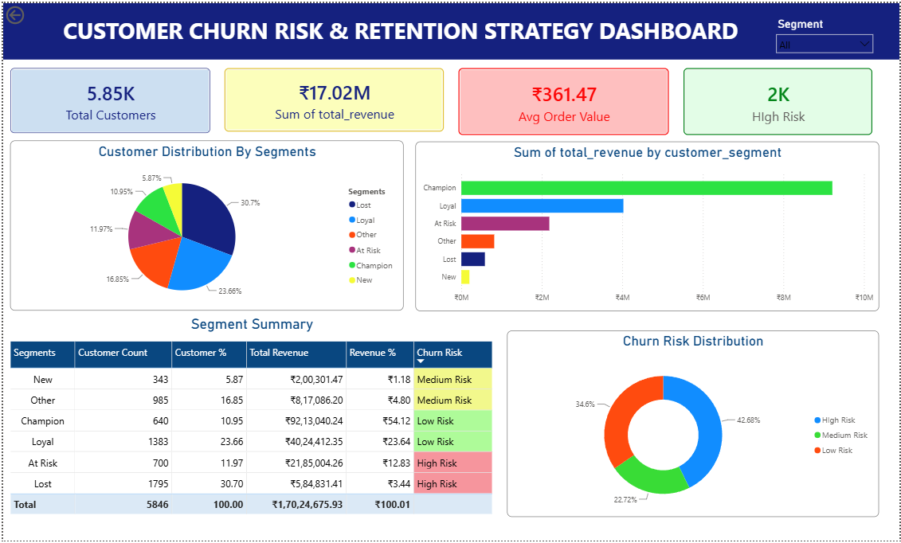

# 📊 Customer Churn Risk & Retention Strategy

A data analytics project that uses **SQL, RFM analysis, and Power BI** to identify customer segments, measure revenue contribution, and classify customers by churn risk.

## 🎯 Business Problem

An online shop may have thousands of customers, but not all customers behave in the same way.

Some customers purchase frequently and spend a lot, while others may have stopped purchasing for a long period.

The main question this project addresses is:

> **Which customers is the business at risk of losing, and what should the business do to retain them?**


## 📌 Data Source

**Online Retail II** dataset from the **UCI Machine Learning Repository**.

The dataset contains two years of real transaction data from a UK-based online retailer, covering transactions from December 2009 to December 2011.

**Dataset:** [UCI Online Retail II Dataset](https://www.archive.ics.uci.edu/dataset/502/online%2Bretail%2Bii?utm_source=chatgpt.com)

## 🔄 Project Workflow

**Raw Transactions → Data Cleaning → SQL Analysis → RFM Analysis → Customer Segmentation → Risk Classification → Power BI Dashboard**

### 1. Data Cleaning

* Removed non-product/fee-related transactions.
* Identified cancelled orders using invoice numbers beginning with `C`.
* Excluded cancelled transactions and customers with missing Customer IDs from customer-level analysis.

### 2. RFM Analysis

For each customer, calculated:

* **Recency** — How recently they purchased
* **Frequency** — How often they purchased
* **Monetary** — How much they spent

Used SQL `NTILE(4)` window functions to score customers across the three RFM dimensions.

### 3. Customer Segmentation

Customers were classified into:

| Segment     | Meaning                                                    |
| ----------- | ---------------------------------------------------------- |
| 🏆 Champion | Recent, frequent, high-value customers                     |
| 🤝 Loyal    | Regular customers with relatively recent purchases         |
| ⚠️ At Risk  | Customers showing signs of declining engagement            |
| 🌱 New      | Recently acquired customers with limited purchase history  |
| ❌ Lost      | Customers with low recency, frequency, and monetary scores |
| Other       | Customers outside the defined segments                     |

### 4. Customer Risk Classification

To make the analysis more actionable, the Power BI dashboard groups the customer segments into three business risk levels:

* 🔴 **High Risk** = At Risk + Lost
* 🟡 **Medium Risk** = New + Other
* 🟢 **Low Risk** = Loyal + Champion

This converts detailed RFM segments into a simpler **customer-risk view** that can support retention analysis and prioritization.

## 📈 Power BI Dashboard

The dashboard provides an interactive view of:

* Customer risk levels
* Customer segment distribution
* Revenue contribution
* Customer counts
* RFM-based customer segmentation



## 🛠️ Tools Used

**PostgreSQL | SQL | Power BI | DAX | Excel | RFM Analysis**

## 📁 Project Structure

```text
customer-churn-risk-retention/
│
├── customer_churn_dashboard.pbix
├── README.md
│
├── images/
│   └── dashboard.png
│
└── sql/
    └── customer_churn_analysis.sql
```

## 📂 SQL Analysis

The complete SQL workflow is available in [`sql/customer_churn_analysis.sql`](sql/customer_churn_analysis.sql).

It covers data cleaning, cancellation handling, RFM calculation, `NTILE` scoring, customer segmentation, and revenue analysis.


